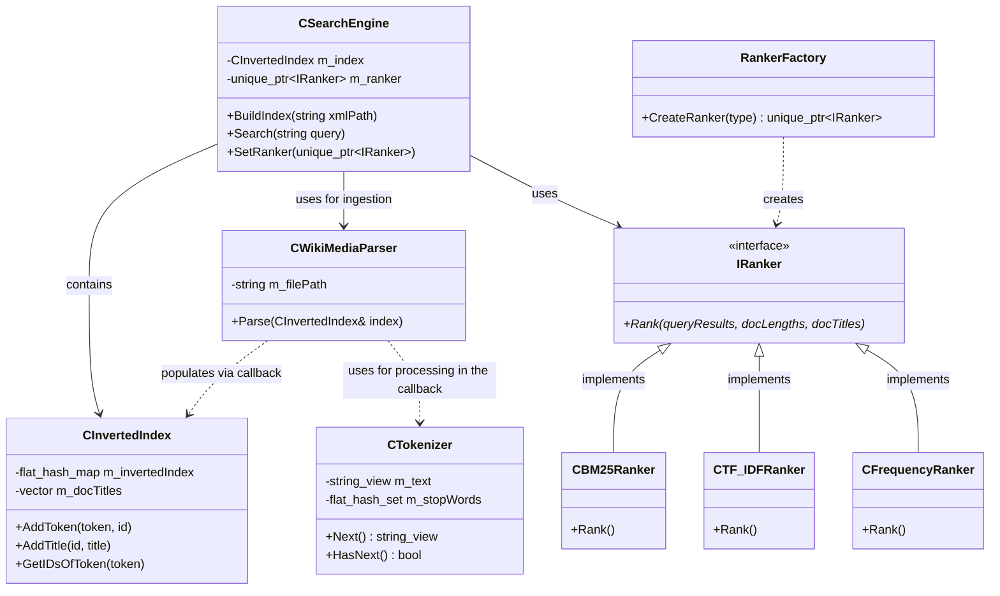

# Wikipedia Search Engine (C++20)

A high-performance search engine built from scratch to index and rank Wikipedia XML dumps. This project implements advanced Information Retrieval (IR) concepts including BM25 ranking, tokenization with stop-word filtering, and a custom inverted index.

## Key Technical Features

* **High-Speed Indexing:** Processes 1.5M+ unique words from large XML dumps in under 25 seconds.
* **Memory Efficiency:** Utilizes **absl::flat_hash_map** for **O(1)** lookups and **std::string_view** for zero-copy string processing.
* **Unit Testing:** Comprehensive test suite using **GoogleTest (GTest)** to verify tokenizer accuracy, index integrity, and ranking mathematical correctness.
* **Advanced Ranking:** Implements multiple ranking strategies via the **Factory Pattern**:
    * **BM25 (Best Matching 25):** State-of-the-art probabilistic relevance model.
    * **TF-IDF:** Traditional statistical importance ranking.
    * **Frequency:** Baseline raw count ranking.
* **Title-Field Boosting:** A custom heuristic that identifies query matches within document titles to prioritize primary entity articles.

---

## Project Architecture

The engine is divided into three primary layers to ensure high maintainability and the **Open-Closed Principle**:

1. **Ingestion Layer:** Parses XML data and uses a stateful **CTokenizer** to strip punctuation and filter out non-informative "stop words."
2. **Storage Layer:** A **CInvertedIndex** that maps tokens to a list of postings (DocID + Frequency) and maintains global document statistics for normalization.
3. **Ranking Layer:** An extensible **IRanker** interface that processes query results and sorts them by relevance.


---

## Reliability & Testing

To ensure the accuracy of the search results and the stability of the index, I implemented unit tests using **GoogleTest**:
* **Tokenizer Tests:** Validated word extraction, stop-word filtering, and handling of complex delimiters.
* **Inverted Index Tests:** Ensured that document frequencies and postings are correctly updated.
* **Ranking Validation:** Verified that the BM25 and TF-IDF formulas produce the expected scores for known document sets.

---

## Performance Benchmarks

* **Build Time:** ~24 seconds (Large Wiki Dataset)
* **Query Latency:** ~7-9ms (Single-word query across 3,900+ matches)
* **RAM Usage:** ~618 MB (Highly optimized via efficient container usage)

---

## Lessons Learned: The "Israel" Problem

A significant challenge during development was the "Ranking Paradox." Initially, the query "israel" returned short biographical stubs or election tables at #1 because they had high keyword density.

**The Solution:**
I implemented **Multi-Field Scoring**. By passing document titles to the ranking layer and applying a **Whole-Word Title Boost**, the engine was able to differentiate between an article *about* Israel and an article that merely *mentions* it. This successfully moved the "State of Israel" article to the #1 spot.

---

## Data Source
This engine is designed to parse **Wikimedia XML Dumps**. 
1. Download a dump (e.g., `enwiki-latest-pages-articles.xml`) from the [Official Wikimedia Dumps](https://dumps.wikimedia.org/).
2. For testing, it is recommended to use a smaller subset or a "multistream" file.

## Build & Run

### Prerequisites
* C++20 compatible compiler (GCC 11+ / Clang 13+)
* CMake 3.15+
* **Abseil-cpp** library - added as submodule
* **GoogleTest** library - added as submodule

### Steps
```bash
mkdir build && cd build
cmake ..
make
./SearchEngine /path/to/your/wiki_dump.xml
